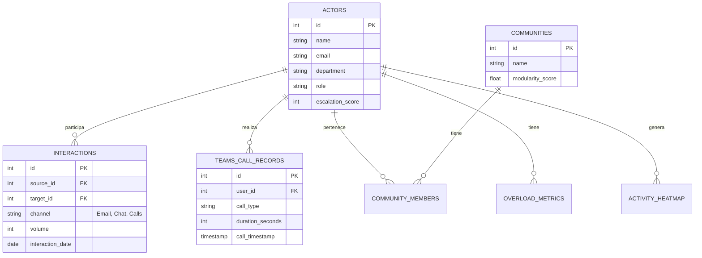

# Modelo de Datos - Olympus v5.1

Este documento detalla la estructura de la base de datos de Olympus, una plataforma de *Organizational Network Analysis* (ONA) centrada en la privacidad ("Privacy-First"). El modelo está diseñado para almacenar metadatos de interacciones sin guardar contenido sensible.

## Diagrama de Entidad-Relación (Core)

## Estructura de Tablas por Módulo

### 1. Núcleo (Core)
Tablas fundamentales para la identidad y las interacciones base.

| Tabla | Descripción |
| :--- | :--- |
| **`actors`** | Usuarios del sistema. Almacena identidad básica (Nombre, Email, Depto) y métricas de nivel alto como `escalation_score`. |
| **`interactions`** | Tabla agregada de conexiones entre actores. Define quién habla con quién, por qué canal y con qué volumen. Única por día/canal. |
| **`influence_links`** | Aristas del grafo de influencia. Almacena el peso calculado de la relación (0-1) para visualizaciones de red. |
| **`settings`** | Configuración del sistema (clave-valor). Almacena credenciales de API, pesos de algoritmos y preferencias de usuario. |

### 2. Ingesta de Datos (Microsoft 365)
Tablas que almacenan la data "cruda" o metadatos extraídos.

| Tabla | Descripción |
| :--- | :--- |
| **`teams_call_records`** | Registro detallado de llamadas de Teams. Incluye duración, tipo (grupo/p2p), uso de video/pantalla y timestamps. Fundamental para heatmaps. |
| **`email_subject_keywords`** | (Privacy-Safe) Conteo de palabras clave en asuntos para detectar tendencias sin leer contenido. |
| **`ad_groups`** | Espejo de grupos de Active Directory / Entra ID. |
| **`ad_group_members`** | Relación de miembros de grupos AD. |

### 3. Análisis Temporal y de Comportamiento
Métricas calculadas sobre la actividad diaria.

| Tabla | Descripción |
| :--- | :--- |
| **`activity_heatmap`** | Actividad por hora del día. Permite visualizar patrones de trabajo (e.g., trabajo nocturno). Base para la corrección de Timezone. |
| **`overload_metrics`** | Métricas semanales de sobrecarga: horas de reunión, emails enviados/recibidos y `risk_level`. |
| **`response_time_analysis`** | Análisis de velocidad de respuesta. Clasifica respuestas en rápidas (<1h) o lentas (>24h). |
| **`timezone_collaboration`** | Métricas de trabajo entre zonas horarias (e.g., emails fuera de horario laboral). |
| **`attendance_patterns`** | Patrones de asistencia a reuniones: aceptadas, rechazadas, llegadas tarde. |

### 4. Detección de Comunidades (Grafos)
Resultados de algoritmos de detección de comunidades (Louvain/Leiden).

| Tabla | Descripción |
| :--- | :--- |
| **`communities`** | Clusters identificados automáticamente. Agrupaciones naturales de comunicación. |
| **`community_members`** | Mapeo de usuarios a comunidades con `membership_strength`. |
| **`network_bridges`** | Usuarios identificados como "puentes" (alta intermediación) que conectan silos. |
| **`organizational_silos`** | Departamentos detectados como aislados (alta conexión interna, baja externa). |

### 5. Análisis de Reuniones
Evaluación de la calidad y eficiencia de las reuniones.

| Tabla | Descripción |
| :--- | :--- |
| **`meeting_efficiency_scores`** | Puntuación de eficiencia por reunión. Considera duración, asistentes y puntualidad. |
| **`meeting_recommendations`** | Sugerencias generadas por IA para mejorar reuniones (e.g., "Reducir participantes"). |

### 6. Analítica Predictiva (IA) && Gamificación
Tablas para modelos de predicción y elementos de juego.

| Tabla | Descripción |
| :--- | :--- |
| **`churn_risk_scores`** | Puntuaciones de riesgo de fuga. Basado en disminución de interacciones y contracción de red. |
| **`burnout_indicators`** | Indicadores de agotamiento: trabajo fuera de horario, reuniones excesivas. |
| **`collaboration_forecasts`** | Pronósticos de tendencias de colaboración futura. |
| **`badges_earned`** | Insignias ganadas por los usuarios (e.g., "Conector", "Estratega"). |
| **`rankings`** | Posiciones históricas en leaderboards. |

### 7. Reportes y Sistema
Tablas de infraestructura y generación de informes.

| Tabla | Descripción |
| :--- | :--- |
| **`batch_jobs`** | Control de ejecución de tareas en segundo plano (ingestión, cálculos). |
| **`report_templates`** | Plantillas definidas para reportes PDF/PPT. |
| **`scheduled_reports`** | Configuración de envíos automáticos de reportes. |
| **`export_history`** | Log de exportaciones de datos realizadas. |
Modelos predictivos sobre riesgos y tendencias.

| Tabla | Descripción |
| :--- | :--- |
| **`churn_risk_scores`** | Probabilidad de rotación. Columns: `risk_score` (0-100), `risk_level` (high/med/low), `engagement_drop` (BOOL), `last_activity_days` (INT), `communication_decline_pct` (FLOAT), `network_shrinkage_pct` (FLOAT), `analysis_date`. |
| **`burnout_indicators`** | Indicadores de agotamiento. Columns: `burnout_score` (0-100), `risk_level`, `sustained_overload_weeks` (INT), `off_hours_work_pct` (FLOAT), `response_time_increase_pct` (FLOAT), `weekend_activity_pct` (FLOAT). |
| **`isolation_alerts`** | Alertas de aislamiento. Columns: `isolation_score` (0-100), `alert_level` (critical/warning), `active_connections_count` (INT), `days_since_last_interaction` (INT), `connection_decline_pct` (FLOAT). |
| **`collaboration_forecasts`** | Predicción de volumen de colaboración futuro por departamento. |

### 7. Gamificación
Sistema de recompensas para incentivar comportamientos positivos.

| Tabla | Descripción |
| :--- | :--- |
| **`achievement_badges`** | Catálogo de insignias (e.g., "Conector Estrella"). |
| **`badges_earned`** | Registro de insignias ganadas por los usuarios. |
| **`network_goals`** | Metas personales de red (e.g., "Conectar con Ventas"). |
| **`connection_suggestions`** | Recomendaciones IA de "A quién deberías conocer". |

### 8. Gestión y Reportes
Tablas de soporte para la operación del sistema.

| Tabla | Descripción |
| :--- | :--- |
| **`scheduled_reports`** | Configuración de envío automático de reportes (PDF/Excel). |
| **`report_templates`** | Plantillas de estructura de reportes. |
| **`export_history`** | Auditoría de exportaciones de datos realizadas. |
| **`batch_jobs`** | Control de procesos asíncronos de larga duración (Ingesta, Cálculo). |
| **`extraction_scopes`** | Configuración de qué usuarios/grupos se deben procesar. |
